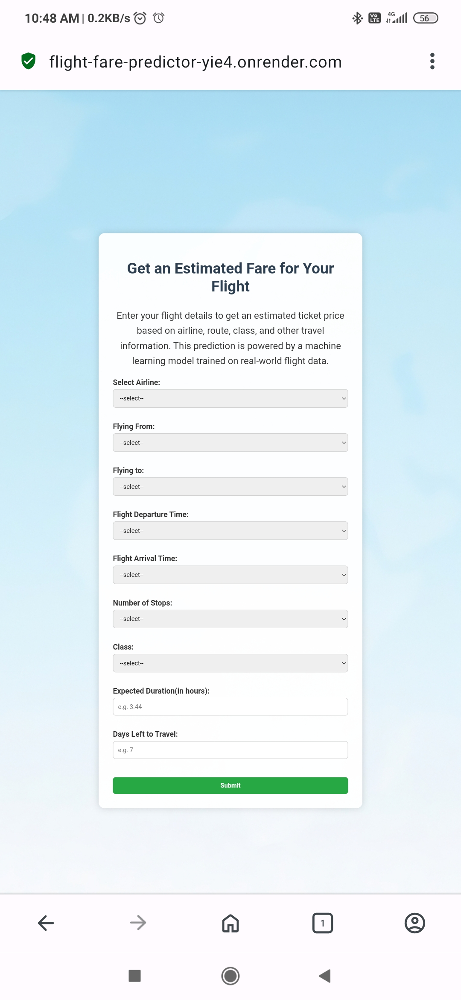
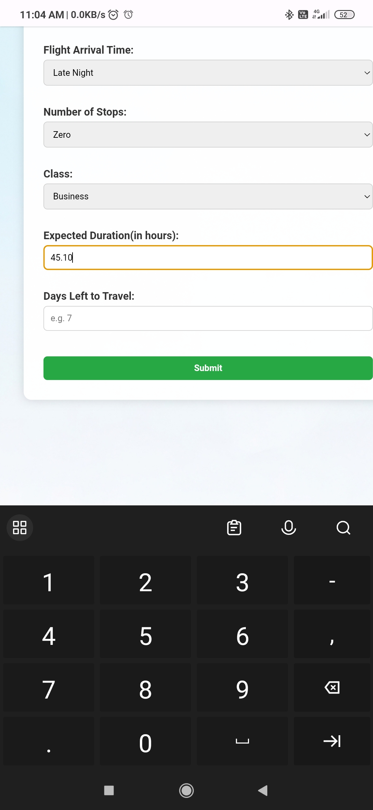
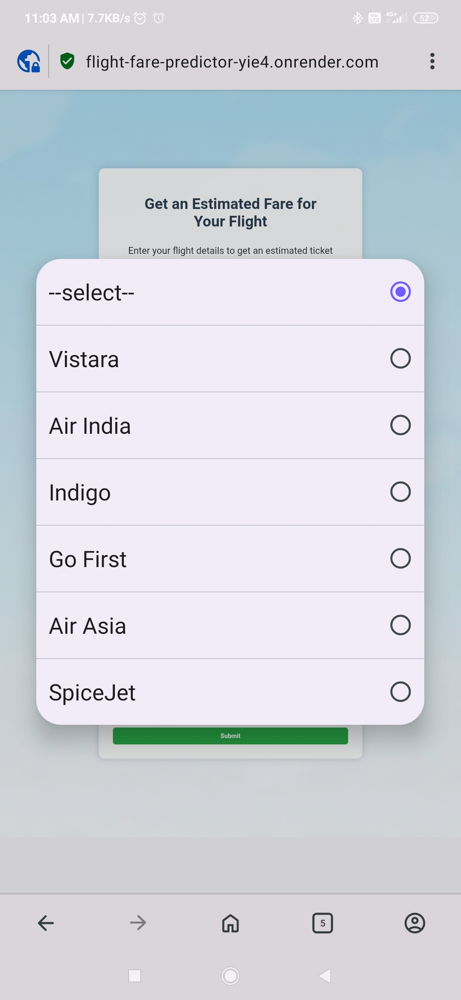

# Flight Fare Price Prediction using xgboost catboost lgbmboost and Web App Deployment

This project focuses on predicting airline ticket prices based on various factors like airline, departure and arrival cities, class, duration, and more. We explored multiple machine learning models, from simple regression to advanced ensemble techniques like XGBoost, CatBoost, and LightGBM.
After comparing performance, XGBoost was found to perform slightly better than the others, and was chosen as the final model for deployment.

The final solution includes a fully functional web application built using Flask and deployed on Render, allowing users to input flight details and receive a predicted fare in real-time.

**link to visit webapp** - https://flight-fare-predictor-yie4.onrender.com

**link to repository where model is deployed using render** - https://github.com/0Baljinder/model_deployment
## WebApp screenshots

 

 
 
---

## Dataset

* **Source**: Kaggle (Airfare Price Prediction) 
* **Total Samples**: `300,153`
* The dataset consists of flight booking records with features such as Airline, Source City, Destination City, Departure Time, Arrival Time, Class, Stops, Duration, Days Left, and more.

---

## Preprocessing Steps

1. **Basic Cleaning**

   * Dropped unnamed columns
   * Removed the flight column (many values with low repetition)

2. **Handled Skewness & Outliers**

   * Price variable was right-skewed due to high prices in business class
   * Applied log transformation to normalize distribution

3. **Categorical Encoding**

   * Used manual label encoding for ordinal features like Stops, Class, Departure/Arrival Time
   * Applied OneHotEncoding for nominal features (Airline, Source City, Destination City)

4. **Feature Correlation & Selection**

   * Found weak positive correlation between Price & Duration
   * Found weak negative correlation between Price & Days Left
   * Features were still retained as weak correlation does not necessarily mean low importance, especially in non-linear models like tree-based models that do not rely on correlation

5. **Final Feature Set**: Duration, Days Left, and encoded features

---

## Exploratory Data Analysis (EDA) Insights

1. **Skewness in Price**

   * Prices were right-skewed, driven mostly by expensive business class tickets

2. **Top Routes**

   * Most flights departed from Delhi and landed in Mumbai
   * Delhi → Mumbai and Mumbai → Delhi were dominant routes

3. **Popular Airlines**

   * Vistara and Air India were the most frequently occurring airlines

4. **Outliers**

   * Smaller airlines with fewer flights had more pricing outliers
   * Top airlines had tighter pricing distributions

5. **Class Distribution**

   * Business class ticket purchases were between 29–33% across all cities (similar ratios)

6. **Time-based Patterns**

   * More flights scheduled during early morning, morning, and evening hours
   * Late-night flights were least preferred

7. **Distribution Trends**

   * Duration showed three distinct spikes — possible different types of routes (short haul, mid, long)
   * Price showed two strong spikes — economic and premium tiers

---

## Modeling Approach

### Baseline Model

* Used Linear Regression as a baseline to establish a performance reference point (not for comparison with complex models)
* Achieved R²: 91%
* MAE (as percentage of target): 2.74%

### Advanced Models

All models were trained on default hyperparameters:

| Model    | R² Score | MAE (%) | MSE (%) |
| -------- | -------- | ------- | ------- |
| XGBoost  | 97%      | 1.39    | 0.37    |
| CatBoost | 97%      | 1.404   | 0.37    |
| LightGBM | 96%      | 1.64    | 0.47    |

Note: XGBoost and CatBoost performed nearly identically. XGBoost had a slightly lower MAE. MSE was the same for both.

---

## Cross Validation

* Cross-validation using XGBoost showed an MAE of 1.404%, validating its stability
* Tried Bayesian Hyperparameter Tuning using `BayesSearchCV`, but tuning did not outperform the default model — possibly because the default model was already near-optimal

---

## Model Deployment & Web App Integration

> Note: When this repository was first created, it focused solely on model development, exploration, and performance testing. At that time, no deployment or web integration was included.
Now, the project has been extended to include model deployment, and the first Colab notebook has been updated to:

Create a pipeline for preprocessing + prediction at the end of the workflow

Save the trained XGBoost model using joblib for deployment

---

## Local Testing with ngrok

To test the trained model in a real-time user-facing environment before deploying it to the cloud, we created a simple Flask web application and tested it locally using ngrok.

# What is ngrok?
Ngrok creates a temporary public URL to expose your local server over the internet. It's especially useful for testing your app on multiple devices or sharing it with collaborators — without needing to deploy it right away.

A separate Colab notebook (ngrok_testing_pipeline.ipynb) was created in this repo to demonstrate:

Loading the saved model pipeline

Setting up a basic Flask app

Simulating how users would enter flight details via a form and get predictions

---

## Cloud Deployment with Render

After local testing, we fully deployed the app to the cloud using Render, a modern platform for deploying web applications and APIs.

Render allows GitHub integration, automatic dependency installation, HTTPS support, and process management.

We used Flask + Gunicorn in production and Render handled all the backend hosting.

Users can now access a fully working web interface to test the flight fare predictor in real-time.

> Note: The Render deployment setup (HTML templates, Flask app, background image, etc.) is maintained in a separate GitHub repository, which contains only the deployment-related code. 

If you'd like to explore the deployed version or test the setup on your own, you can check the deployment repo here:
# Deployment Repository Link
https://github.com/0Baljinder/model_deployment

## Challenges & Limitations

* Despite hyperparameter tuning attempts using Bayesian Optimization, the suggested hyperparameter combinations failed to outperform the default configuration
* The CSS code for the deployment web app was created with the help of ChatGPT, as I currently don't have frontend development experience. However, this process helped me understand the importance of UI/UX in presenting models to users, and I plan to learn the CSS basics in the future to gain more control over styling.

---

## Key Takeaways

* XGBoost and CatBoost are powerful, highly performant models even with default settings
* Linear Regression served as a reliable baseline model, helping benchmark expectations for advanced models
* Feature engineering and encoding play a critical role in regression-based prediction tasks

---

## Important Info

* This project was created and tested on Google Colab

  * Some code paths rely on Google Drive mounting (adjust accordingly if not using Colab)
